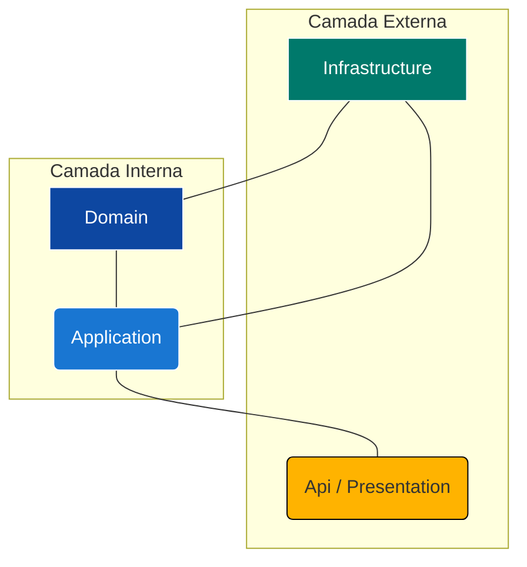

<div align="center">
  
# 🚀 LevelUp API

**Uma API RESTful para Gamificação no Ambiente de Trabalho**

</div>

<p align="center">
  
  
  
  
</p>

---

## 🧑‍💻 Autores

<div align="center">

| Nome | RM |
| :--- | :--- |
| **Wesley Sena dos Santos** | 558043 |
| **Vanessa Yukari Iwamoto** | 558092 |
| **Samara Victoria Ferraz dos Santos** | 558719 |

</div>

---

## 🔗 Links

[](https://youtu.be/AXnxzQ7-6b8) 

---

## 🎯 Sobre o Projeto

O **LevelUp** é uma solução de back-end robusta, construída em .NET 8 com Clean Architecture, projetada para a Global Solution da FIAP com o tema "O Futuro do Trabalho".

O objetivo desta API é centralizar uma plataforma de **gamificação** para engajamento de funcionários. O sistema permite que administradores (como o RH) gerenciem recompensas e que usuários (funcionários) acumulem pontos ao completar tarefas, podendo resgatar esses pontos por itens em uma "loja" interna.

Esta API serve como o "cérebro" econômico do sistema, gerenciando:
* **Identidade:** Registro e autenticação de usuários (Funcionários e Admins).
* **Economia:** O saldo de pontos de cada usuário.
* **Loja:** O catálogo de recompensas (prêmios) e seu estoque.
* **Histórico:** O extrato de resgates de cada usuário.

## ✨ Funcionalidades Principais

Esta API não é apenas um CRUD, mas uma implementação completa de padrões modernos de desenvolvimento:

* **Clean Architecture:** O código é estritamente separado em 4 camadas (`Domain`, `Application`, `Infrastructure`, `Api`) para máxima manutenibilidade e testabilidade.
* **Autenticação JWT:** Acesso seguro usando JSON Web Tokens (Bearer Token) gerados no login.
* **Autorização por Roles:** Endpoints distintos para `USER` (funcionários) e `ADMIN` (RH), utilizando `[Authorize(Roles = "...")]`.
* **Suporte a Múltiplos Bancos:** Projetado para rodar com **Oracle** (localmente) e **SQL Server** (na nuvem) alterando apenas a configuração.
* **Versionamento de API:** Os endpoints são versionados por URL (ex: `/api/v1/Users`), implementado com `Asp.Versioning.Mvc`.
* **HATEOAS:** As respostas (especialmente listas) incluem links de ações (`self`, `update`, `delete`), permitindo que o cliente descubra a API dinamicamente.
* **Exclusão Lógica (Soft Delete):** Usuários e Recompensas não são deletados fisicamente; eles são desativados (`IS_ACTIVE = 'N'`) para manter a integridade do histórico.
* **Validação (DTOs):** Uso de `Data Annotations` nas Entidades e DTOs para garantir a integridade dos dados na entrada.
* **Testes Completos (xUnit):**
    * **Testes de Unidade (Domínio):** Validando as regras das entidades.
    * **Testes de Unidade (Aplicação):** Usando `Moq` para simular os repositórios e testar a lógica de negócio (UseCases).
    * **Testes de Integração (API):** Usando `WebApplicationFactory` para testar os Controllers, HATEOAS e Status Codes.
* **Procedures (Oracle):** Os métodos `CreateAsync` (no build Oracle) utilizam Procedures (`PKG_LEVELUP_APP`) para executar a lógica de inserção dentro do banco.

---

## 🛠️ Tech Stack

O projeto utiliza as seguintes tecnologias:

* **Back-end:** .NET 8 (ASP.NET Core)
* **Arquitetura:** Clean Architecture
* **Banco de Dados:**
    * Oracle (para desenvolvimento local)
* **ORM:** Entity Framework Core 8
* **Autenticação:** JWT (Bearer Token)
* **Hashing de Senha:** BCrypt.Net-Next (compatível com Spring Security)
* **Testes:**
    * xUnit (Framework de Teste)
    * Moq (Framework de Mocking)
    * Microsoft.AspNetCore.Mvc.Testing (Testes de Integração)
* **Documentação:** Swagger (OpenAPI) com exemplos customizados (`Swashbuckle.AspNetCore.Filters`)
* **Deploy:** Docker & Render

---

## 🏗️ Arquitetura

O projeto segue rigorosamente os princípios da Clean Architecture para garantir a separação de responsabilidades (SoC). O fluxo de dependência é sempre de fora para dentro: as camadas externas (como `Presentation` e `Infrastructure`) dependem das camadas internas (como `Application`), mas as camadas internas nunca dependem das externas.


**Legenda:**

* <span style="color:#0D47A1">**Azul Escuro (Domain):**</span> O núcleo do sistema. Contém as **Entidades** e **Interfaces de Repositório**. Não depende de nada.
* <span style="color:#1976D2">**Azul (Application):**</span> Contém a **lógica de negócio**. Define os **DTOs**, **Mappers** e **UseCases**. Depende apenas do `Domain`.
* <span style="color:#00796B">**Verde (Infrastructure):**</span> A camada de infraestrutura. Implementa as interfaces do `Domain` usando o EF Core (`ApplicationContext`) e os **Repositórios**.
* <span style="color:#FFB300">**Laranja (Api):**</span> A camada de apresentação. Contém os **Controllers**, `Program.cs`, `Dockerfile` e `appsettings.json`. É o único ponto de entrada.

*(Os projetos `LevelUp.Tests` e `LevelUp.Api.Doc` existem para validar e documentar essas camadas.)*

## 🚀 Como Executar Localmente (Ambiente Oracle)

Este guia pressupõe que você está configurando o ambiente de desenvolvimento principal, que utiliza um banco de dados **Oracle**.

### 1. Pré-requisitos

* [.NET 8 SDK](https://dotnet.microsoft.com/download/dotnet/8.0)
* Um servidor de Banco de Dados **Oracle** (local ou na nuvem) acessível.
* Uma ferramenta de gerenciamento de banco (ex: Oracle SQL Developer, DBeaver).
* (Opcional) Docker Desktop, se for rodar o Oracle em um container.

### 2. Configuração do Banco de Dados

Este projeto utiliza uma abordagem híbrida:
1.  O **.NET (EF Core)** gerencia as tabelas de `Users`, `Teams`, `Rewards`, e `RewardRedemptions` via Migrations.
2.  Um **Script SQL** manual gerencia as tabelas do Java (`Tasks`, `Completions`, etc.) e todas as `Procedures` do banco.

É crucial seguir esta ordem:

#### Passo 2.1: Configurar a Connection String

1.  No projeto `LevelUp.Presentation`, encontre ou crie o arquivo `appsettings.Development.json`.
2.  Configure-o com suas credenciais do Oracle. Este arquivo **não** deve ser enviado ao Git.

**Arquivo: `LevelUp.Api/appsettings.Development.json`**
```json
{
  "Logging": {
    "LogLevel": {
      "Default": "Information",
      "Microsoft.AspNetCore": "Warning"
    }
  },
  "DatabaseProvider": "Oracle",
  "ConnectionStrings": {
    "DefaultConnection": "Data Source=(DESCRIPTION=(ADDRESS_LIST=(ADDRESS=(PROTOCOL=TCP)(HOST=oracle.fiap.com.br)(PORT=1521)))(CONNECT_DATA=(SERVER=DEDICATED)(SID=ORCL)));User Id=SEU_USER;Password=SUA_SENHA;"
  },
  "Jwt": {
    "SecretKey": "CHAVE_SECRETA_DE_DESENVOLVIMENTO_PODE_SER_QUALQUER_COISA",
    "ExpiresInHours": 8
  }
}
```

#### Passo 2.2: Rodar a Migração do .NET (Criar Tabelas .NET)

1.  Abra o Visual Studio e vá em **Tools > NuGet Package Manager > Package Manager Console**.
2.  No console, configure os dois menus dropdown:
    * **Default project:** `LevelUp.Infra.Data`
    * **Startup project:** `LevelUp.Api`
3.  Execute o comando para aplicar a migração mais recente e criar as tabelas `USERS`, `TEAMS`, `REWARDS`, etc.:
    ```powershell
    Update-Database
    ```

#### Passo 2.3: Rodar o Script SQL (Criar Tabelas Java e Procedures)

1.  Agora que as tabelas do .NET existem, abra o arquivo `script-banco-java.sql` (ou o nome que você deu) no seu SQL Developer.
2.  Execute este script no seu banco de dados.
3.  Este script irá:
    * Criar as tabelas restantes (`TB_LEVELUP_TASKS`, `TB_LEVELUP_TASK_ASSIGNMENTS`, etc.).
    * Criar o pacote `PKG_LEVELUP_APP` (com todas as procedures).
    * Criar todos os `Triggers` de auditoria.

### 3. Configurar um Usuário Admin

Para testar os endpoints protegidos (`[Authorize(Roles = "ADMIN")]`), você precisa de um administrador.

1.  Registre um novo usuário pela API (`POST /api/v1/Auth/register`).
2.  Abra o SQL Developer e atualize a `ROLE` desse usuário:
    ```sql
    UPDATE TB_LEVELUP_USERS
    SET ROLE = 'ADMIN'
    WHERE EMAIL = 'seu-email-de-admin@levelup.com';
    
    COMMIT;
    ```

### 4. Executar a Aplicação

Abra um terminal na raiz da solução (pasta do `.sln`) e execute:

```bash
dotnet run --project LevelUp.Presentation
```

Ou simplesmente inicio o projeto `LevelUp.Presentation` no Visual Studio.

Sua API está rodando em:

* **Swagger (UI)**: `http://localhost:[PORTA]/swagger`
* **Health (API)**: `http://localhost:[PORTA]/swagger/api/v1/Health/live`
* **Health (Banco)**: `http://localhost:[PORTA]/swagger/api/v1/ready`

## 🧪 Como Rodar os Testes

O projeto possui uma suíte de testes xUnit completa que valida todas as camadas da aplicação (Domain, Application e Api).

### No Visual Studio

1.  Vá até o menu **Test** na barra superior.
2.  Clique em **Test Explorer**.
3.  Clique no ícone **Run All Tests** (play).

### Pelo Terminal

1.  Abra um terminal na **pasta raiz da solução** (onde está o `LevelUp.sln`).
2.  Execute o comando `dotnet test`:

```bash
dotnet test
```

O .NET O .NET irá compilar a solução e executar todos os testes dos 3 tipos:

* **Testes de Domínio**: Validam as `Entities` (ex `UserEntityTests`).
* **Testes de Aplicação**: Validam a lógica de negócio nos UseCases (ex: `AuthUseCaseTests`, `RewardRedemptionUseCaseTests`) usando `Moq`.
* **Testes de API (Integração)**: Validam os Controllers (ex: `AuthControllerTests`, `UserControllerTests`) usando `WebApplicationFactory`.

## 📖 Guia de Endpoints (API Reference)

A API está versionada e todos os endpoints estão sob o prefixo `/api/v1/`.

* **URL Base (Local):** `http://localhost:[PORTA]/api/v1`
* **URL Base (Deploy):** `https://levelup-cwd0.onrender.com/api/v1`

---

### 🔑 Autenticação e Autorização

O acesso à API é controlado por **Tokens JWT (Bearer Token)**.

#### Fluxo de Autenticação

1.  **Registro (`POST /Auth/register`):** Crie um novo usuário.
2.  **Login (`POST /Auth/login`):** Envie o email e senha deste usuário.
3.  **Receber o Token:** A API retornará um JSON contendo o `token`.
4.  **Copiar o Token:** Copie a string `token` (o texto longo que começa com `ey...`).
5.  **Usar o Token:** Para todos os outros endpoints, vá na aba **Authorization** do Postman, selecione **Bearer Token**, e cole o token lá. A API irá ler este token para identificar você e suas permissões (`ROLE`).

---

### 1. Auth Controller
**Endpoint Base:** `/api/v1/Auth`
Controlador anônimo para registro e login.

| Método | Rota | Descrição | Auth | Exemplo de JSON (Body) |
| :--- | :--- | :--- | :--- | :--- |
| `POST` | `/register` | Registra um novo usuário (sempre como "USER"). | `AllowAnonymous` | `(UserCreateRequestSample)` |
| `POST` | `/login` | Autentica um usuário e retorna um Token JWT. | `AllowAnonymous` | `(AuthRequestSample)` |

#### Exemplo de JSON (AuthRequestSample)
```json
{
    "email": "admin@levelup.com",
    "password": "AdminPassword123!"
}
```

#### Exemplo de JSON (UserCreateRequestSample)
```json
{
    "fullName": "Novo Usuário da Silva",
    "email": "novo.usuario@levelup.com",
    "password": "NovaSenha@123",
    "jobTitle": "Analista de QA Jr.",
    "teamId": 1
}
```

---

### 2. User Controller
**Endpoint Base:** `/api/v1/User`
Gerencia os perfis de usuário.

| Método | Rota | Descrição | Auth | Exemplo de JSON (Body) |
| :--- | :--- | :--- | :--- | :--- |
| `GET` | `/me` | Busca o perfil do **próprio** usuário logado. | `USER`, `ADMIN` | (Nenhum) |
| `GET` | `/list` | **[ADMIN]** Lista todos os usuários (paginado). | `ADMIN` | (Nenhum) |
| `GET` | `/{id}` | **[ADMIN]** Busca um usuário por ID. | `ADMIN` | (Nenhum) |
| `PUT` | `/{id}` | **[ADMIN]** Atualiza um usuário (inclui `pointBalance`). | `ADMIN` | `(UserUpdateRequestSample)` |
| `DELETE`| `/{id}` | **[ADMIN]** Desativa (Soft Delete) um usuário. | `ADMIN` | (Nenhum) |

#### Exemplo de JSON (UserUpdateRequestSample)
```json
{
    "fullName": "Usuário Atualizado",
    "email": "usuario.atualizado@levelup.com",
    "jobTitle": "Analista de QA Pleno",
    "role": "USER",
    "teamId": 2,
    "pointBalance": 5000
}
```

---

### 3. Reward Controller
**Endpoint Base:** `/api/v1/Reward`
Gerencia o catálogo da "loja" de recompensas.

| Método | Rota | Descrição | Auth | Exemplo de JSON (Body) |
| :--- | :--- | :--- | :--- | :--- |
| `GET` | `/list` | Lista todas as recompensas (a "loja"). | `USER`, `ADMIN` | (Nenhum) |
| `GET` | `/{id}` | Busca uma recompensa por ID. | `USER`, `ADMIN` | (Nenhum) |
| `POST` | | **[ADMIN]** Cria uma nova recompensa. | `ADMIN` | `(RewardCreateRequestSample)`|
| `PUT` | `/{id}` | **[ADMIN]** Atualiza uma recompensa (nome, custo, estoque). | `ADMIN` | `(RewardUpdateRequestSample)`|
| `DELETE`| `/{id}` | **[ADMIN]** Desativa (Soft Delete) uma recompensa. | `ADMIN` | (Nenhum) |

#### Exemplo de JSON (RewardCreateRequestSample)
```json
{
    "name": "Gift Card Steam R$50",
    "description": "R$50 em créditos para usar na plataforma Steam.",
    "pointCost": 350,
    "stockQuantity": 100
}
```

---

### 4. RedemptionReward Controller
**Endpoint Base:** `/api/v1/RedemptionReward`
Controlador para o fluxo de resgate de pontos.

| Método | Rota | Descrição | Auth | Exemplo de JSON (Body) |
| :--- | :--- | :--- | :--- | :--- |
| `POST` | `/{rewardId}`| Resgata uma recompensa (usa o `userId` do token). | `USER`, `ADMIN` | (Nenhum) |
| `GET` | `/my-history`| Busca o histórico de resgates do usuário logado. | `USER`, `ADMIN` | (Nenhum) |

---

### 5. Team Controller
**Endpoint Base:** `/api/v1/Team`
Gerencia as equipes de funcionários.

| Método | Rota | Descrição | Auth | Exemplo de JSON (Body) |
| :--- | :--- | :--- | :--- | :--- |
| `GET` | `/list` | Lista todas as equipes. | `USER`, `ADMIN` | (Nenhum) |
| `GET` | `/{id}` | Busca uma equipe por ID. | `USER`, `ADMIN` | (Nenhum) |
| `POST` | | **[ADMIN]** Cria uma nova equipe. | `ADMIN` | `(TeamCreateRequestSample)`|
| `PUT` | `/{id}` | **[ADMIN]** Atualiza o nome de uma equipe. | `ADMIN` | `(TeamUpdateRequestSample)`|
| `DELETE`| `/{id}` | **[ADMIN]** Deleta (Hard Delete) uma equipe. | `ADMIN` | (Nenhum) |

#### Exemplo de JSON (TeamCreateRequestSample)
```json
{
    "teamName": "Equipe de Engenharia Alpha"
}
```

---

### 6. Health Controller
**Endpoint Base:** `/api/v1/Health`
Verifica a saúde da aplicação e do banco.

| Método | Rota | Descrição | Auth |
| :--- | :--- | :--- | :--- |
| `GET` | `/live` | Verifica se a API está no ar (saúde da aplicação). | `AllowAnonymous` |
| `GET` | `/ready` | Verifica se a API consegue se conectar ao banco. | `AllowAnonymous` |
